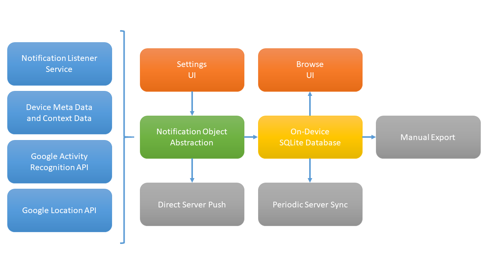

# Notification Log for Android

An Open-Source Framework for Notification Research on Mobile Devices.

* Supports Android 4.4 (API level 19) - Android 10.0 (API level 29)
* [Notification Log app in the Google Play Store](https://play.google.com/store/apps/details?id=org.hcilab.projects.nlog)
* [Notification Log position paper in the ACM Digital Library](https://dl.acm.org/citation.cfm?doid=3267305.3274118)

## Abstract

In the past decade, the number of always-connected mobile devices exploded. Smartphones are always with the user and host a large number of applications and services that use notifications to gain the user's attention. These notifications and their effects on users have been extensively researched in the context of human-computer interaction. In a body of prior work, numerous small- and large-scale studies were conducted to understand notifications as well as their effects. A common theme in these studies is the need for accessing users' notifications, often for logging purposes. In this paper, we present an open-source framework for notification research on mobile devices. The framework has been used as the foundation of multiple in-the-wild and in-lab studies, and has been downloaded by over 60,000 users. We explain the requirements, the architecture, and past application scenarios of the framework. The scenarios range from enabling reflection on mobile notifications to rich experiences in multi-device environments.

## Architecture



## Projects

Notification Log was used in multiple studies:

* Dominik Weber, Alexandra Voit, Gisela Kollotzek, and Niels Henze. 2019. **Annotif: A System for Annotating Mobile Notifications in User Studies**. In Proceedings of the 18th International Conference on Mobile and Ubiquitous Multimedia (MUM '19). ACM, New York, NY, USA, Article 24, 12 pages. DOI: https://doi.org/10.1145/3365610.3365611
* Dominik Weber, Alexandra Voit, and Niels Henze. 2019. **Clear All: A Large-Scale Observational Study on Mobile Notification Drawers**. In Proceedings of Mensch und Computer 2019 (MuC '19). ACM, New York, NY, USA, 361-372. DOI: https://doi.org/10.1145/3340764.3340765
* Dominik Weber, Alexandra Voit, Gisela Kollotzek, Lucas van der Vekens, Marcus Hepting, Florian Alt, and Niels Henze. 2018. **PD Notify: Investigating Personal Content on Public Displays**. In Extended Abstracts of the 2018 CHI Conference on Human Factors in Computing Systems (CHI EA '18). ACM, New York, NY, USA, Paper LBW014, 6 pages. DOI: https://doi.org/10.1145/3170427.3188475
* Dominik Weber, Alexandra Voit, Huy Viet Le, and Niels Henze. 2016. **Notification Dashboard: Enabling Reflection on Mobile Notifications**. In Proceedings of the 18th International Conference on Human-Computer Interaction with Mobile Devices and Services Adjunct (MobileHCI '16). ACM, New York, NY, USA, 936-941. DOI: https://doi.org/10.1145/2957265.2962660
* Thomas Kubitza, Alexandra Voit, Dominik Weber, and Albrecht Schmidt. 2016. **An IoT Infrastructure for Ubiquitous Notifications in Intelligent Living Environments**. In Proceedings of the 2016 ACM International Joint Conference on Pervasive and Ubiquitous Computing: Adjunct (UbiComp '16). ACM, New York, NY, USA, 1536-1541. DOI: https://doi.org/10.1145/2968219.2968545 
* Dominik Weber, Sven Mayer, Alexandra Voit, Rodrigo Ventura Fierro, and Niels Henze. 2016. **Design Guidelines for Notifications on Smart TVs**. In Proceedings of the ACM International Conference on Interactive Experiences for TV and Online Video (TVX '16). ACM, New York, NY, USA, 13-24. DOI: https://doi.org/10.1145/2932206.2932212

## Citation

How to cite this work:

> Dominik Weber, Alexandra Voit, and Niels Henze. 2018. **Notification Log: An Open-Source Framework for Notification Research on Mobile Devices**. In Proceedings of the 2018 ACM International Joint Conference and 2018 International Symposium on Pervasive and Ubiquitous Computing and Wearable Computers (UbiComp '18). ACM, New York, NY, USA, 1271-1278. DOI: https://doi.org/10.1145/3267305.3274118 

```text
@inproceedings{Weber:2018:NLO:3267305.3274118,
 author = {Weber, Dominik and Voit, Alexandra and Henze, Niels},
 title = {Notification Log: An Open-Source Framework for Notification Research on Mobile Devices},
 booktitle = {Proceedings of the 2018 ACM International Joint Conference and 2018 International Symposium on Pervasive and Ubiquitous Computing and Wearable Computers},
 series = {UbiComp '18},
 year = {2018},
 isbn = {978-1-4503-5966-5},
 location = {Singapore, Singapore},
 pages = {1271--1278},
 numpages = {8},
 url = {http://doi.acm.org/10.1145/3267305.3274118},
 doi = {10.1145/3267305.3274118},
 acmid = {3274118},
 publisher = {ACM},
 address = {New York, NY, USA},
 keywords = {Notifications, data collection, digital well-being, interruptions, mobile devices, open-source framework},
}
```
